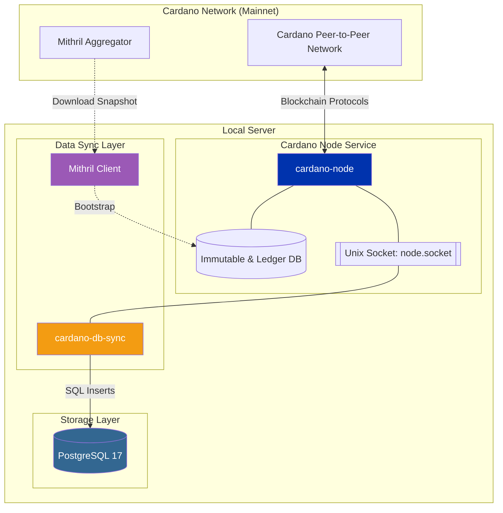

# Set Up Cardano Mainnet Availability

This documentation describes how to deploy a Cardano relay node and a synchronized PostgreSQL database using **cardano-db-sync**. This configuration uses **Mithril** to accelerate blockchain synchronization and includes snapshotting methods to optimize data recovery and performance.

:::info

Given the size of the Cardano mainnet database, use snapshots and optimize your PostgreSQL setup (instructions included). This ensures synchronization can be completed in hours instead of days.

:::
## Architecture overview

The following diagram illustrates the data flow between the Cardano network, the local node, and the storage layer.



## 1. Download the Cardano database snapshot

Mithril provides verified snapshots of the Cardano blockchain. Using Mithril reduces synchronization time from several days to approximately 20 minutes.

### 1.1 Install Mithril tooling

1. Create a temporary directory for the installation:

    ```bash
    mkdir -p $HOME/tmp/mithril && cd $HOME/tmp/mithril
    ```

2. Download and install the Mithril signer, client, and aggregator:

    ```bash
    curl --proto '=https' --tlsv1.2 -sSf https://raw.githubusercontent.com/input-output-hk/mithril/refs/heads/main/mithril-install.sh | sh -s -- -c mithril-signer -d latest -p $(pwd)
    curl --proto '=https' --tlsv1.2 -sSf https://raw.githubusercontent.com/input-output-hk/mithril/refs/heads/main/mithril-install.sh | sh -s -- -c mithril-client -d latest -p $(pwd)
    curl --proto '=https' --tlsv1.2 -sSf https://raw.githubusercontent.com/input-output-hk/mithril/refs/heads/main/mithril-install.sh | sh -s -- -c mithril-aggregator -d latest -p $(pwd)
    ```

### 1.2 Configure environment variables

Configure your environment based on the network you are targeting. You can find the latest configurations in the [Mithril Network Documentation](https://mithril.network/doc/manual/getting-started/network-configurations).

```bash
export CARDANO_NETWORK=mainnet
export AGGREGATOR_ENDPOINT=https://aggregator.release-mainnet.api.mithril.network/aggregator
export GENESIS_VERIFICATION_KEY=$(wget -q -O - https://raw.githubusercontent.com/input-output-hk/mithril/main/mithril-infra/configuration/release-mainnet/genesis.vkey)
export ANCILLARY_VERIFICATION_KEY=$(wget -q -O - https://raw.githubusercontent.com/input-output-hk/mithril/main/mithril-infra/configuration/release-mainnet/ancillary.vkey)
export SNAPSHOT_DIGEST=latest
```

:::info

Mainnet snapshots are significantly larger than testnet snapshots and will take longer to download and verify.

:::
### 1.3 Download the snapshot

Run the following commands to list, verify, and download the database:

```bash
# List available snapshots
./mithril-client cardano-db snapshot list

# Show details for the target snapshot
./mithril-client cardano-db snapshot show $SNAPSHOT_DIGEST

# Download the database
./mithril-client cardano-db download --include-ancillary $SNAPSHOT_DIGEST
```

The snapshot is saved to a `db/` directory in your current path (e.g., `/tmp/mithril/db`).

## 2. Set up the Cardano relay node

This section uses the official pre-compiled binaries. If you prefer to build from source, refer to the [Cardano Node documentation](https://github.com/IntersectMBO/cardano-node).

### 2.1 Download Cardano node binaries

1. Create the necessary directories:

    ```bash
    mkdir -p ~/.local/bin ~/.local/share
    ```

2. Download and extract the binaries (Version 10.6.2):

    ```bash
    VERSION="11.0.1"
    ARCH="linux-amd64"
    URL="https://github.com/IntersectMBO/cardano-node/releases/download/${VERSION}/cardano-node-${VERSION}-${ARCH}.tar.gz"

    curl -L "$URL" | tar -xz -C ~/.local/bin --strip-components=2 ./bin
    curl -L "$URL" | tar -xz -C ~/.local/share --strip-components=1 ./share
    chmod +x ~/.local/bin/cardano-*
    ```

3. Verify the installation:

    ```bash
    echo 'export PATH="$HOME/.local/bin:$PATH"' >> ~/.bashrc
    source ~/.bashrc

    cardano-node --version
    ```

### 2.2 Initialize the data directory

Create a directory to store the blockchain data and move the Mithril snapshot into it.

```bash
mkdir ~/cardano-data
mv ~/tmp/mithril/db/ ~/cardano-data/
```

# seeing the snapshot worked on test start

cardano-node run \
    --topology $HOME/.local/share/mainnet/topology.json \
    --database-path /mnt/disks/cardano-data/db \
    --socket-path /mnt/disks/cardano-data/db/node.socket \
    --host-addr 0.0.0.0 \
    --port 3001 \
    --config $HOME/.local/share/mainnet/config.json

[2026-06-23 16:31:47.0806Z][cardano-mainnet-db-sync:ChainDB.ImmDbEvent.ChunkValidation.StartedValidatingChunk](Info,5) Validating chunk no. 8824 out of 8824. Progress: 99.99%
[2026-06-23 16:31:47.2798Z][cardano-mainnet-db-sync:ChainDB.ImmDbEvent.ChunkValidation.ValidatedChunk](Info,5) Validated chunk no. 8824 out of 8824. Progress: 100.00%

# 1. Map the socket to your shell environment
export CARDANO_NODE_SOCKET_PATH="/mnt/disks/cardano-data/db/node.socket"

# 2. Run the simple query
cardano-cli query tip --mainnet
{
    "block": 13586523,
    "epoch": 638,
    "era": "Conway",
    "hash": "071d91cde3c559dc526a73c54030671178f28d524e6c99b8ad3d81e97fabf138",
    "slot": 190640961,
    "slotInEpoch": 388161,
    "slotsToEpochEnd": 43839,
    "syncProgress": "99.99"

### 2.3 Configure the systemd service

Create a service file at `/etc/systemd/system/cardano-node.service` to manage the node process. Replace `[USER]` with your Linux username and ensure the paths match your network (Preprod or Mainnet).

```toml
[Unit]
Description=Cardano Relay Node
Wants=network-online.target
After=network-online.target

[Service]
User=[USER]
Type=simple
WorkingDirectory=/home/[USER]/cardano-data
ExecStart=/home/[USER]/.local/bin/cardano-node run \
    --topology /home/[USER]/.local/share/mainnet/topology.json \
    --database-path /home/[USER]/cardano-data/db \
    --socket-path /home/[USER]/cardano-data/db/node.socket \
    --host-addr 0.0.0.0 \
    --port 3001 \
    --config /home/[USER]/.local/share/mainnet/config.json
KillSignal=SIGINT
Restart=always
RestartSec=5
LimitNOFILE=32768

[Install]
WantedBy=multi-user.target
```

**To start the service:**

```bash
sudo systemctl daemon-reload
sudo systemctl enable cardano-node
sudo systemctl start cardano-node
```

## 3. Configure PostgreSQL 17

Cardano-db-sync requires a PostgreSQL backend to store indexed blockchain data.

### 3.1 Install PostgreSQL

```bash
sudo apt install curl ca-certificates -y
sudo install -d /usr/share/postgresql-common/pgdg
sudo curl -s -o /usr/share/postgresql-common/pgdg/apt.postgresql.org.asc --fail https://www.postgresql.org/media/keys/ACCC4CF8.asc
sudo sh -c 'echo "deb [signed-by=/usr/share/postgresql-common/pgdg/apt.postgresql.org.asc] https://apt.postgresql.org/pub/repos/apt $(lsb_release -cs)-pgdg main" > /etc/apt/sources.list.d/pgdg.list'
sudo apt update && sudo apt -y install postgresql-17 postgresql-server-dev-17
```

### 3.2 Initialize the database and roles

Log in as the `postgres` user to create your database and application user:

sudo -u postgres psql

```sql
CREATE USER midnight WITH PASSWORD 'your_secure_password';
ALTER ROLE midnight WITH SUPERUSER CREATEDB;
CREATE DATABASE cexplorer;
```

### 3.3 Configure authentication

Create a `.pgpass` file to allow `cardano-db-sync` to connect without manual password entry.

```bash
export POSTGRES_PASSWORD='your_secure_password'
export PGPASSFILE="${HOME}/.pgpass"

echo "/var/run/postgresql:5432:cexplorer:midnight:$POSTGRES_PASSWORD" > "$PGPASSFILE"
chmod 0600 "$PGPASSFILE"
```

### 3.4 Performance tuning

:::warning

For Mainnet, you must optimize PostgreSQL settings in `/etc/postgresql/17/main/postgresql.conf`.

:::
Update the following values:

| **Parameter** | **Recommended Value** | **Description** |
| --- | --- | --- |
| `shared_buffers` | 16GB | Keeps more of the ledger in active memory. |
| `maintenance_work_mem` | 4GB | Accelerates index building during synchronization. |
| `max_parallel_maintenance_workers` | 4 | Allows multiple CPU cores to build indexes. |
| `effective_cache_size` | 48GB | Informs the planner of available system RAM for caching. |
| `join_collapse_limit` | 1 | Force Postgres to follow the exact join order |

## 4. Set up cardano-db-sync

### 4.1 Install binaries and schema

1. Download the latest release:

    ```bash
    NETWORK="mainnet"
    mkdir -p ~/tmp && cd ~/tmp
    curl -L -O https://github.com/IntersectMBO/cardano-db-sync/releases/download/13.7.1.0/cardano-db-sync-13.7.1.0-linux.tar.gz
    tar -xzf cardano-db-sync-13.7.1.0-linux.tar.gz
    ```

2. Install binaries and schema:

    ```bash
    cp bin/* ~/.local/bin/
    mkdir -p ~/cardano-data/
    sudo mv ~/tmp/schema ~/cardano-data/
    ```

3. Configure the node path in the config file:

    ```bash
    cd ~/cardano-data
    curl -O https://book.world.dev.cardano.org/environments/$NETWORK/db-sync-config.json
    sed -i "s|\"NodeConfigFile\": \"config.json\"|\"NodeConfigFile\": \"/home/[USER]/.local/share/$NETWORK/config.json\"|" ~/cardano-data/db-sync-config.json
    ```

### 4.2 Restore from a database snapshot

Syncing from genesis can take several days. Use a [trusted snapshot](https://update-cardano-mainnet.iohk.io/cardano-db-sync/index.html) to accelerate the process.

https://update-cardano-mainnet.iohk.io/cardano-db-sync/13.7/db-sync-snapshot-schema-13.7-block-13567432-x86_64.tgz

1. Download and extract the snapshot:

    ```bash
    wget [SNAPSHOT_URL]
    pv [SNAPSHOT_FILE].tgz | tar -xf -
    mv ~/tmp/*.lstate.gz ~/cardano-data/db-sync-state/
    ```

2. Restore to PostgreSQL:

    ```bash
    pg_restore -h /var/run/postgresql -U midnight -d cexplorer -Fd ~/tmp/db -v --no-owner --no-privileges --jobs=4
    ```

### 4.3 Manage the db-sync service

Create `/etc/systemd/system/cardano-db-sync.service`:

```toml
[Unit]
Description=Cardano DB Sync
After=cardano-node.service
Requires=cardano-node.service

[Service]
User=[USER]
Type=simple
Environment="PGPASSFILE=/home/[USER]/.pgpass"
WorkingDirectory=/home/[USER]/cardano-data
ExecStart=/home/[USER]/.local/bin/cardano-db-sync \
    --config /home/[USER]/cardano-data/db-sync-config.json \
    --socket-path /home/[USER]/cardano-data/db/node.socket \
    --schema-dir /home/[USER]/cardano-data/schema \
    --state-dir /home/[USER]/cardano-data/db-sync-state
KillSignal=SIGINT
Restart=always
RestartSec=10
LimitNOFILE=32768

[Install]
WantedBy=multi-user.target
```

**Enable and start:**

```bash
sudo systemctl daemon-reload
sudo systemctl enable cardano-db-sync
sudo systemctl start cardano-db-sync
```

## 5. Verify synchronization

To check the current status of the database synchronization, run the following SQL query:

```sql
psql -d cexplorer -c "SELECT block_no, slot_no, time FROM block ORDER BY id DESC LIMIT 1;"
```

To calculate the sync percentage:

```sql
psql -d cexplorer -c "
SELECT 
    100 * (EXTRACT(epoch FROM (MAX(time) AT TIME ZONE 'UTC')) - EXTRACT(epoch FROM (MIN(time) AT TIME ZONE 'UTC'))) 
    / (EXTRACT(epoch FROM (NOW() AT TIME ZONE 'UTC')) - EXTRACT(epoch FROM (MIN(time) AT TIME ZONE 'UTC'))) 
AS sync_percent 
FROM block;"
```
