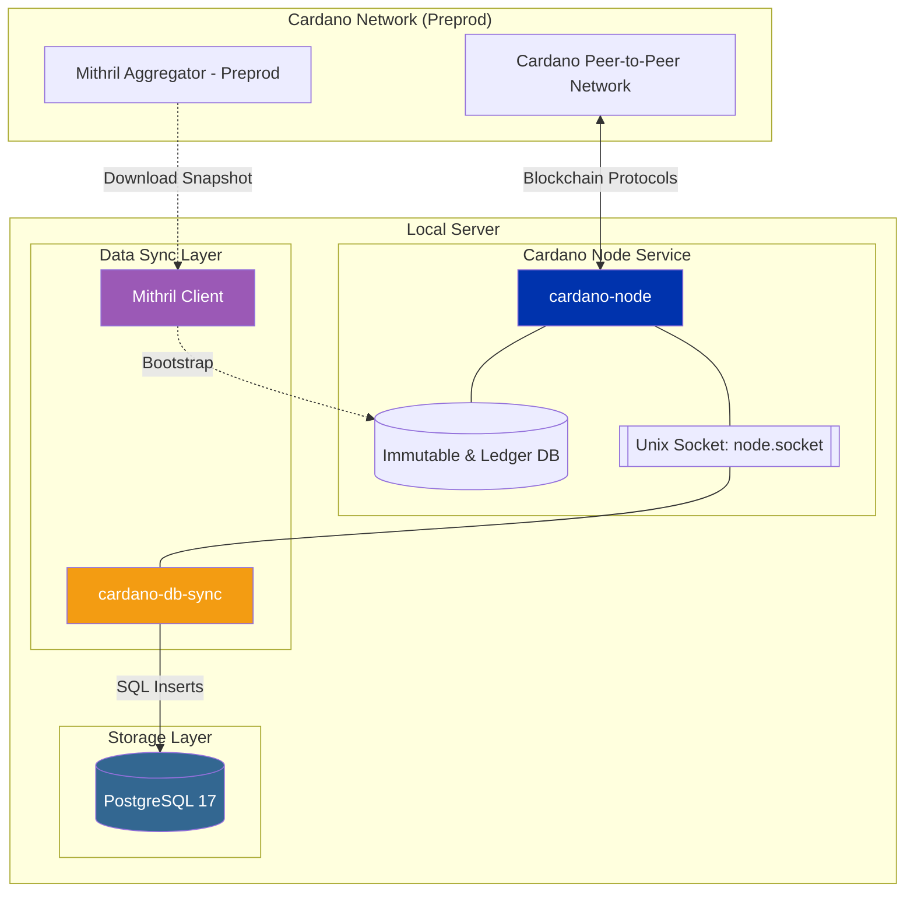

# Set Up Cardano Preprod Availability

This documentation describes how to deploy a Cardano relay node and a synchronized PostgreSQL database using **cardano-db-sync** for the **Preprod** network. This configuration uses **Mithril** to accelerate blockchain synchronization.

:::info[Preprod vs Mainnet]

Preprod uses a different Mithril aggregator endpoint, a smaller database, and different chain configuration files.

:::
## Architecture overview



## 1. Download the Cardano database snapshot

### 1.1 Install Mithril tooling

```bash
mkdir -p $HOME/tmp/mithril && cd $HOME/tmp/mithril

curl --proto '=https' --tlsv1.2 -sSf https://raw.githubusercontent.com/input-output-hk/mithril/refs/heads/main/mithril-install.sh | sh -s -- -c mithril-signer -d unstable -p $(pwd)
curl --proto '=https' --tlsv1.2 -sSf https://raw.githubusercontent.com/input-output-hk/mithril/refs/heads/main/mithril-install.sh | sh -s -- -c mithril-client -d unstable -p $(pwd)
curl --proto '=https' --tlsv1.2 -sSf https://raw.githubusercontent.com/input-output-hk/mithril/refs/heads/main/mithril-install.sh | sh -s -- -c mithril-aggregator -d unstable -p $(pwd)
```

### 1.2 Configure environment variables (Preprod)

```bash
export CARDANO_NETWORK=preprod
export AGGREGATOR_ENDPOINT=https://aggregator.release-preprod.api.mithril.network/aggregator
export GENESIS_VERIFICATION_KEY=$(wget -q -O - https://raw.githubusercontent.com/input-output-hk/mithril/main/mithril-infra/configuration/release-preprod/genesis.vkey)
export ANCILLARY_VERIFICATION_KEY=$(wget -q -O - https://raw.githubusercontent.com/input-output-hk/mithril/main/mithril-infra/configuration/release-preprod/ancillary.vkey)
export SNAPSHOT_DIGEST=latest
```

:::note

For the latest aggregator endpoints and keys, refer to the [Mithril Network Documentation](https://mithril.network/doc/manual/getting-started/network-configurations).

:::
### 1.3 Download the snapshot

```bash
# List available snapshots
./mithril-client cardano-db snapshot list

# Show details for the target snapshot
./mithril-client cardano-db snapshot show $SNAPSHOT_DIGEST

# Download the database
./mithril-client cardano-db download --include-ancillary $SNAPSHOT_DIGEST
```

The snapshot is saved to a `db/` directory in your current path.

## 2. Set up the Cardano relay node

### 2.1 Download Cardano node binaries

```bash
mkdir -p ~/.local/bin ~/.local/share

VERSION="10.6.2"
ARCH="linux-amd64"
URL="https://github.com/IntersectMBO/cardano-node/releases/download/${VERSION}/cardano-node-${VERSION}-${ARCH}.tar.gz"

curl -L "$URL" | tar -xz -C ~/.local/bin --strip-components=2 ./bin
curl -L "$URL" | tar -xz -C ~/.local/share --strip-components=1 ./share
chmod +x ~/.local/bin/cardano-*

cardano-node --version
```

### 2.2 Initialize the data directory

```bash
mkdir ~/cardano-data
mv ~/tmp/mithril/db/ ~/cardano-data/
```

### 2.3 Configure the systemd service

Create `/etc/systemd/system/cardano-node.service`. Replace `[USER]` with your Linux username.

```toml
[Unit]
Description=Cardano Relay Node (Preprod)
Wants=network-online.target
After=network-online.target

[Service]
User=[USER]
Type=simple
WorkingDirectory=/home/[USER]/cardano-data
ExecStart=/home/[USER]/.local/bin/cardano-node run \
    --topology /home/[USER]/.local/share/preprod/topology.json \
    --database-path /home/[USER]/cardano-data/db \
    --socket-path /home/[USER]/cardano-data/db/node.socket \
    --host-addr 0.0.0.0 \
    --port 3001 \
    --config /home/[USER]/.local/share/preprod/config.json
KillSignal=SIGINT
Restart=always
RestartSec=5
LimitNOFILE=32768

[Install]
WantedBy=multi-user.target
```

```bash
sudo systemctl daemon-reload
sudo systemctl enable cardano-node
sudo systemctl start cardano-node
```

## 3. Configure PostgreSQL 17

### 3.1 Install PostgreSQL

```bash
sudo apt install curl ca-certificates -y
sudo install -d /usr/share/postgresql-common/pgdg
sudo curl -s -o /usr/share/postgresql-common/pgdg/apt.postgresql.org.asc --fail https://www.postgresql.org/media/keys/ACCC4CF8.asc
sudo sh -c 'echo "deb [signed-by=/usr/share/postgresql-common/pgdg/apt.postgresql.org.asc] https://apt.postgresql.org/pub/repos/apt $(lsb_release -cs)-pgdg main" > /etc/apt/sources.list.d/pgdg.list'
sudo apt update && sudo apt -y install postgresql-17 postgresql-server-dev-17
```

### 3.2 Initialize the database and roles

```sql
CREATE USER midnight WITH PASSWORD 'your_secure_password';
ALTER ROLE midnight WITH SUPERUSER CREATEDB;
CREATE DATABASE cexplorer;
```

### 3.3 Configure authentication

```bash
export POSTGRES_PASSWORD='your_secure_password'
export PGPASSFILE="${HOME}/.pgpass"

echo "/var/run/postgresql:5432:cexplorer:midnight:$POSTGRES_PASSWORD" > "$PGPASSFILE"
chmod 0600 "$PGPASSFILE"
```

### 3.4 Performance tuning

Preprod database sizes are significantly smaller than Mainnet. Tuning is less critical but still recommended.

Update `/etc/postgresql/17/main/postgresql.conf`:

| **Parameter** | **Recommended Value** | **Description** |
| --- | --- | --- |
| `shared_buffers` | 4GB | Keeps ledger data in active memory. |
| `maintenance_work_mem` | 1GB | Accelerates index building during sync. |
| `max_parallel_maintenance_workers` | 2 | Allows multiple cores to build indexes. |
| `effective_cache_size` | 12GB | Informs the planner of available RAM for caching. |
| `join_collapse_limit` | 1 | Force Postgres to follow the exact join order. |

## 4. Set up cardano-db-sync

### 4.1 Install binaries and schema

```bash
NETWORK="preprod"
mkdir -p ~/tmp && cd ~/tmp
curl -L -O https://github.com/IntersectMBO/cardano-db-sync/releases/download/13.6.0.5/cardano-db-sync-13.6.0.7-linux.tar.gz
tar -xzf cardano-db-sync-13.6.0.7-linux.tar.gz

cp bin/* ~/.local/bin/
mkdir -p ~/cardano-data/
sudo mv ~/tmp/schema ~/cardano-data/

cd ~/cardano-data
curl -O https://book.world.dev.cardano.org/environments/$NETWORK/db-sync-config.json
sed -i "s|\"NodeConfigFile\": \"config.json\"|\"NodeConfigFile\": \"/home/[USER]/.local/share/$NETWORK/config.json\"|" ~/cardano-data/db-sync-config.json
```

### 4.2 Restore from a database snapshot (optional)

Preprod sync from genesis is faster than Mainnet, but a snapshot can still save time.

```bash
wget [SNAPSHOT_URL]
pv [SNAPSHOT_FILE].tgz | tar -xf -
mv ~/tmp/*.lstate.gz ~/cardano-data/db-sync-state/

pg_restore -h /var/run/postgresql -U midnight -d cexplorer -Fd ~/tmp/db -v --no-owner --no-privileges --jobs=4
```

### 4.3 Manage the db-sync service

Create `/etc/systemd/system/cardano-db-sync.service`:

```toml
[Unit]
Description=Cardano DB Sync (Preprod)
After=cardano-node.service
Requires=cardano-node.service

[Service]
User=[USER]
Type=simple
Environment="PGPASSFILE=/home/[USER]/.pgpass"
WorkingDirectory=/home/[USER]/cardano-data
ExecStart=/home/[USER]/.local/bin/cardano-db-sync \
    --config /home/[USER]/cardano-data/db-sync-config.json \
    --socket-path /home/[USER]/cardano-data/db/node.socket \
    --schema-dir /home/[USER]/cardano-data/schema \
    --state-dir /home/[USER]/cardano-data/db-sync-state
KillSignal=SIGINT
Restart=always
RestartSec=10
LimitNOFILE=32768

[Install]
WantedBy=multi-user.target
```

```bash
sudo systemctl daemon-reload
sudo systemctl enable cardano-db-sync
sudo systemctl start cardano-db-sync
```

## 5. Verify synchronization

```sql
psql -d cexplorer -c "SELECT block_no, slot_no, time FROM block ORDER BY id DESC LIMIT 1;"
```

To calculate sync percentage:

```sql
psql -d cexplorer -c "
SELECT
    100 * (EXTRACT(epoch FROM (MAX(time) AT TIME ZONE 'UTC')) - EXTRACT(epoch FROM (MIN(time) AT TIME ZONE 'UTC')))
    / (EXTRACT(epoch FROM (NOW() AT TIME ZONE 'UTC')) - EXTRACT(epoch FROM (MIN(time) AT TIME ZONE 'UTC')))
AS sync_percent
FROM block;"
```
